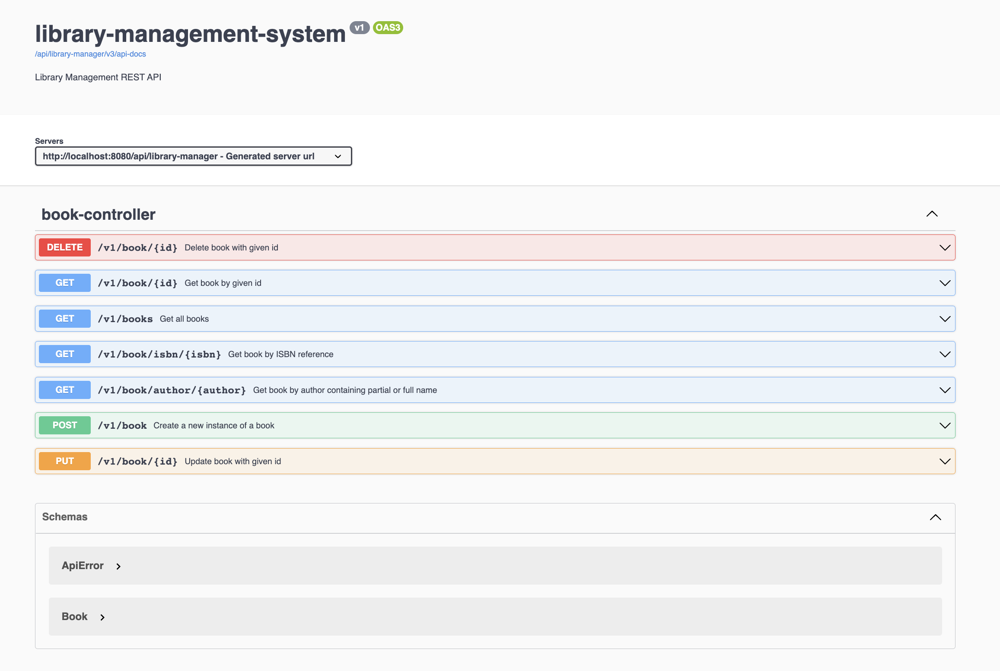

## library-management-system 📚
Library management system is a simple Spring Boot RESTful API to perform crud functions for a given book in an inventory.

This RESTful uses a H2 in-memory datasource to create/read/update/delete books by making use of Spring JPA repositories, which allows us to rapidly implement a data access layer as it is represented by classes and objects instead of tables and records.
It was designed and developed with a Spring MVC design pattern in mind which inherits all the IoC and dependency injection features of the core Spring Framework.

The MVC pattern is inherited with the dependency injection of `spring-boot-starter-parent`, and this allows us to hide logic behind 3 components which can be broken down into:

1. Model - Handles all the data and business logic of an application
   * In this case Book is the model that handles the data and underlying logic
2. Controller - Passes information from the model to view 
   * In this case BookController handles the presentation of the underlying service.
3. View - Handles the elements of the user interface or the representation thereof.
   * In this case the Book model represents the visualization of the data model.

### Practices used

1. Seperating business logic from controllers apart from routing and delegating actions to the proper service.
2. Leveraging bean validation, using the javax.validation to add contraints to validate input.
3. Making use of global and custom error handlers, by throwing meaningful exceptions to the user.
4. OpenApi implementation and annotations which allows us to make the API descriptive and well documented.
5. Monitoring and availability - making use of the `spring-boot-starter-actuator` dependency to monitor and interact with the application.

### Next steps

1. Seperate Book Entity with DTO to minise misuse when overriding some auto-generated database fields
2. Implement borrowing book API 

___

### Requirements

1. Java 1.8.x
2. Maven 3.8.x

### Steps to setup

* Clone the application
````
 git clone https://github.com/toufeeqkalam/library-management-system.git
````
* Install mvn dependencies
````
 mvn clean install
````
* Starting the application
````
 mvn spring-boot:run
````

### Dependencies used:
* H2 in-memory datastore
* Spring Starter Web
* Spring Starter JPA
* Lombok
* OpenApi

### Utilities
* Actuator: http://localhost:8080/api/library-manager/actuator
  * Exposed endpoints:
    * /actuator/health
    * /actuator/info
    * 

### Base CRUD Endpoints:

* Get all books from the datasoure

````
 GET - http://localhost:8080/api/library-manager/v1/books
````

```
curl -X 'GET' \
  'http://localhost:8080/api/library-manager/v1/books' \
  -H 'accept: application/json'
```

````
[
  {
    "id": 1,
    "title": "It",
    "author": "Stephen King",
    "publisher": "Viking",
    "isbn": "0-670-81302-8",
    "quantity": 5
  },
  {
    "id": 2,
    "title": "A Game of Thrones",
    "author": "George R. R. Martin",
    "publisher": "Bantam Spectra",
    "isbn": "0-553-10354-7",
    "quantity": 3
  },
  {
    "id": 3,
    "title": "The Da Vinci Code",
    "author": "Dan Brown",
    "publisher": "Doubleday",
    "isbn": "0-385-50420-9",
    "quantity": 1
  }
]

````
* Get book by given /{id}

````
 GET - http://localhost:8080/api/library-manager/v1/book/{id}
````

````
curl -X 'GET' \
  'http://localhost:8080/api/library-manager/v1/book/1' \
  -H 'accept: application/json'
````

````
{
  "id": 1,
  "title": "It",
  "author": "Stephen King",
  "publisher": "Viking",
  "isbn": "0-670-81302-8",
  "quantity": 5
}
````
* Save new instance of a book

````
POST - http://localhost:8080/api/library-manager/v1/book
````

````
curl -X 'POST' \
  'http://localhost:8080/api/library-manager/v1/book' \
  -H 'accept: application/json' \
  -H 'Content-Type: application/json' \
  -d '{
  "title": "Long Walk to Freedom",
  "author": "Nelson Mandela",
  "publisher": "Little, Brown",
  "isbn": "0-316-87496-5",
  "quantity": 4
}'
````

* Update book with given id

````
PUT - http://localhost:8080/api/library-manager/v1/book/4
````

````
curl -X 'PUT' \
  'http://localhost:8080/api/library-manager/v1/book/4' \
  -H 'accept: application/json' \
  -H 'Content-Type: application/json' \
  -d '{
  "title": "Long Walk to Freedom",
  "author": "Nelson Mandela",
  "publisher": "Little, Brown",
  "isbn": "0-316-87496-5",
  "quantity": 2
}'
````

* Delete book by given id

````
DELETE - http://localhost:8080/api/library-manager/v1/book/{id}
````

````
curl -X 'DELETE' \
  'http://localhost:8080/api/library-manager/v1/book/4' \
  -H 'accept: application/json'
````




  